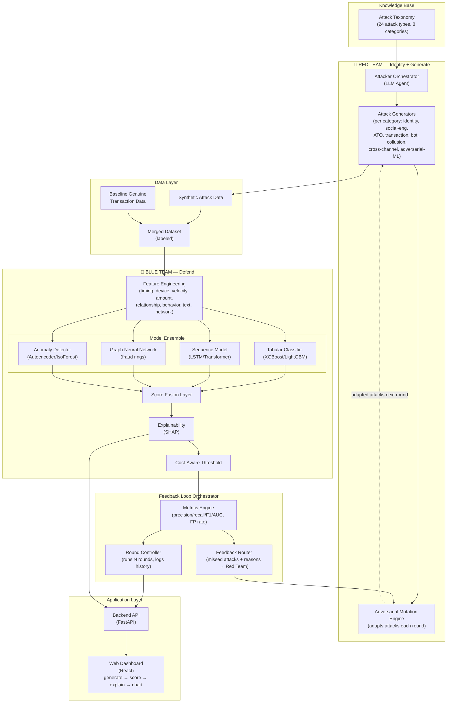
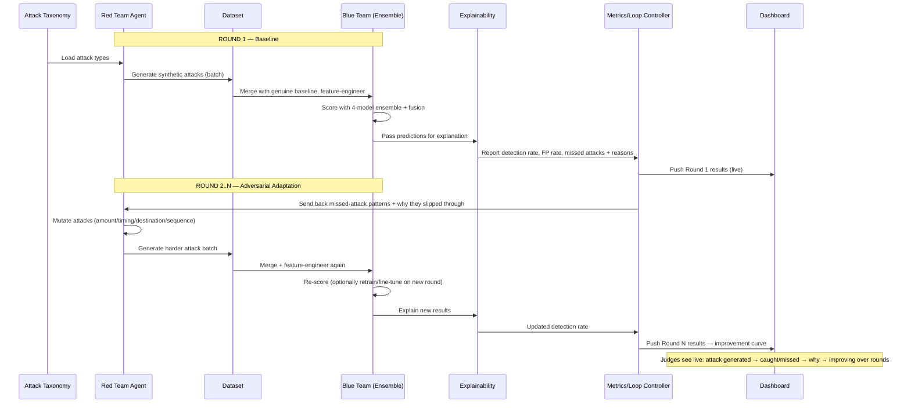

# AI Defense Lab — System Architecture, Workflow & Project Structure

Mastercard Innovation Challenge 2026 — technical design reference for the team.

---

## 1. High-Level System Architecture



**Reading the diagram:** the Knowledge Base seeds the Red Team. Red Team output merges with genuine baseline data and flows through the Blue Team's feature + model pipeline. The Loop Orchestrator scores the round, tells the Red Team exactly what it got away with, and the Red Team comes back harder next round. The Application Layer exposes all of this live to the judges.

---

## 2. End-to-End Workflow (Step by Step)



**In plain terms:**
1. Load the attack taxonomy → Red Team generates a first batch of fake attacks.
2. Mix with genuine transaction data → engineer features → Blue Team scores everything.
3. Explainability shows *why* each call was made; metrics show what got missed.
4. Missed attacks + reasons go back to the Red Team, which crafts a tougher version.
5. Repeat for several rounds, logging detection-rate improvement each time.
6. Dashboard shows this whole loop live, round by round.

---

## 3. Component Breakdown

| Component | Responsibility | Suggested Tech |
|---|---|---|
| Attack Taxonomy KB | Structured store of attack types + simulate recipes | JSON/YAML config, or vector DB if agent needs retrieval |
| Attacker Orchestrator | Picks attack type, prompts LLM to generate attack parameters | LLM API (Claude/GPT) + prompt templates |
| Attack Generators | Turn attack parameters into structured synthetic records | Python (Faker, NumPy, pandas), per-category generator classes |
| Mutation Engine | Adjusts attack params based on feedback | Python — rule-based + LLM-guided search |
| Feature Engineering | Raw events → model-ready features | pandas, feature-engine, custom velocity/window functions |
| Tabular Classifier | Single-transaction fraud detection | XGBoost / LightGBM |
| Sequence Model | Behavior-over-time fraud | PyTorch/TensorFlow LSTM or small Transformer |
| Graph Neural Network | Fraud ring / mule network detection | PyTorch Geometric / DGL |
| Anomaly Detector | Catches novel/unlabeled attack types | Scikit-learn IsolationForest or Autoencoder (Keras/PyTorch) |
| Score Fusion | Combines model outputs into one score | Logistic regression / weighted ensemble |
| Explainability | Feature-level reasons for each score | SHAP |
| Cost-Aware Threshold | Sets fraud cutoff by cost trade-off | Custom cost-matrix logic |
| Loop Orchestrator | Runs rounds, tracks metrics, routes feedback | Python controller script/service |
| Backend API | Serves data/scores/metrics to frontend | FastAPI |
| Frontend Dashboard | Visualizes the loop live | React + Recharts/Chart.js |
| Storage | Persist synthetic data, models, run history | PostgreSQL / SQLite for hackathon scale |

---

## 4. Project (Repo) Structure

```
mastercard-ai-defense-lab/
├── README.md
├── docs/
│   ├── problem_statement.md
│   ├── architecture.md                 # this document
│   ├── attack_taxonomy.md              # from provided PDF
│   └── solution_walkthrough.pptx       # submission artifact #2
│
├── data/
│   ├── schemas/                        # field defs for transactions/events
│   ├── baseline_genuine/               # synthetic "normal" transactions
│   ├── synthetic_attacks/              # generated per round, per attack type
│   └── round_history/                  # snapshot of each loop round's dataset
│
├── red_team/                           # PILLAR 1 + 2: Identify & Generate
│   ├── taxonomy/
│   │   └── attack_taxonomy.yaml        # structured version of the 24 attacks
│   ├── agents/
│   │   └── attacker_orchestrator.py    # LLM agent picking + directing attacks
│   ├── generators/
│   │   ├── identity_fraud_gen.py
│   │   ├── social_engineering_gen.py
│   │   ├── account_takeover_gen.py
│   │   ├── transaction_manip_gen.py
│   │   ├── synthetic_bot_gen.py
│   │   ├── merchant_collusion_gen.py
│   │   ├── cross_channel_gen.py
│   │   └── adversarial_ml_gen.py
│   └── mutation/
│       └── mutation_engine.py          # adapts attacks based on feedback
│
├── blue_team/                          # PILLAR 3: Defend
│   ├── features/
│   │   └── feature_pipeline.py
│   ├── models/
│   │   ├── tabular_model.py
│   │   ├── sequence_model.py
│   │   ├── graph_model.py
│   │   └── anomaly_model.py
│   ├── fusion/
│   │   └── score_fusion.py
│   ├── explainability/
│   │   └── shap_explainer.py
│   └── thresholding/
│       └── cost_aware_threshold.py
│
├── loop/                               # Closed-loop orchestration
│   ├── orchestrator.py                 # runs N rounds end-to-end
│   ├── metrics.py                      # precision/recall/F1/AUC, FP rate
│   ├── feedback_router.py              # sends missed-attack info to red_team
│   └── config.yaml                     # number of rounds, thresholds, etc.
│
├── api/                                # Backend for the web prototype
│   ├── main.py
│   └── routes/
│       ├── generate.py
│       ├── score.py
│       └── metrics.py
│
├── frontend/                           # Working web prototype (submission artifact #3)
│   ├── src/
│   │   ├── components/
│   │   │   ├── AttackFeed.jsx
│   │   │   ├── ScoreCard.jsx
│   │   │   ├── ExplainabilityPanel.jsx
│   │   │   └── RoundProgressChart.jsx
│   │   └── App.jsx
│   └── package.json
│
├── notebooks/                          # EDA, experiments, model prototyping
│   └── model_experiments.ipynb
│
├── tests/
│   ├── test_generators.py
│   ├── test_models.py
│   └── test_loop.py
│
├── requirements.txt
└── .env.example
```

---

## 5. Build Order (Practical Sequence for the Team)

```mermaid
flowchart LR
    A["1. Attack taxonomy<br/>→ YAML config"] --> B["2. Baseline genuine<br/>data generator"]
    B --> C["3. One attack generator<br/>(e.g. card testing)"]
    C --> D["4. Feature pipeline"]
    D --> E["5. One classifier<br/>(tabular, XGBoost)"]
    E --> F["6. Thin end-to-end<br/>loop (1 round)"]
    F --> G["7. Add remaining<br/>attack generators"]
    G --> H["8. Add sequence + graph<br/>+ anomaly models"]
    H --> I["9. Add explainability<br/>+ feedback loop (N rounds)"]
    I --> J["10. Backend API"]
    J --> K["11. Frontend dashboard"]
    K --> L["12. Polish + record demo<br/>+ finalize write-up"]
```



**Why this order:** get one thin slice working end-to-end first (steps 1–6) — this proves the loop concept early and de-risks the demo. Only after that, widen coverage (more attacks, more models) and add polish (explainability, UI). This avoids the common hackathon failure mode of building each pillar in isolation and discovering integration problems on the last day.

---

## 6. Mapping Back to Submission Requirements

| Submission Artifact | Comes From |
|---|---|
| Code Repository (GitHub) | Entire structure above — `red_team/`, `blue_team/`, `loop/`, `api/`, `frontend/` |
| Solution Walkthrough (deck/doc) | `docs/solution_walkthrough.pptx`, built from README + architecture + results |
| Working Web Prototype | `frontend/` + `api/`, demonstrating the closed loop live |
